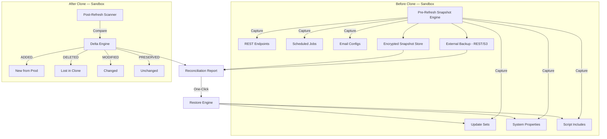

# sandbox-migration-shield

**Sandbox Clone Protection & Configuration Recovery for ServiceNow**

[](LICENSE)
[](https://www.servicenow.com)
[](https://docs.servicenow.com)

A production-grade ServiceNow scoped application that prevents data loss and configuration drift during sandbox refresh/clone operations. Captures a pre-refresh snapshot of your sandbox environment, compares it against the post-refresh state, and provides one-click restores for lost customizations — update sets, system properties, script includes, REST endpoints, and more.

## Overview

ServiceNow sandbox refreshes are a double-edged sword. They keep development environments synchronized with production, but they silently destroy everything unique to the sandbox: in-progress update sets, custom system properties, scripted REST APIs, scheduled jobs, email configurations, UI policies — weeks of development work vanished in a single clone operation.

Sandbox Migration Shield solves this by acting as a safety net. Before every clone, it captures a complete encrypted snapshot of your sandbox's customizations across 10+ configuration categories. After the clone, it compares the post-refresh state against the pre-snapshot and produces a reconciliation report showing exactly what was **lost, changed, or preserved**. For lost items, it provides one-click restore functionality, bringing back update sets, properties, and custom code in seconds rather than weeks of rebuilding.

Built by ServiceNow Solution Architect Vladimir Kapustin after witnessing multiple teams lose critical development work to unplanned sandbox refreshes. The shield eliminates the "hope nothing important was lost" anxiety that accompanies every clone operation.

## Architecture

The shield operates in four layers: pre-refresh snapshot capture, post-refresh delta computation, reconciliation and restore, and governance/audit. All operations run within the sandbox instance — production is never touched.



**Layer 1 — Pre-Refresh Snapshot Engine:** Runs on the sandbox before clone. Captures all configuration categories into an encrypted JSON blob. Dual backup: stored in-instance (attachments) + exported to external REST endpoint for survival if sandbox is fully wiped.

**Layer 2 — Post-Refresh Delta Engine:** Re-scans the same categories after clone. Computes per-item classification: ADDED (new from production), DELETED (was in sandbox, lost), MODIFIED (changed during clone), PRESERVED (survived clone).

**Layer 3 — Reconciliation & Restore:** Generates a categorized reconciliation report with risk score. For DELETED items, provides one-click restore using pre-snapshot data. Conflict detection prevents overwriting post-clone customizations.

**Layer 4 — Governance & Audit:** Every snapshot, delta, and restore operation is logged with timestamp, user, and scope. Compliance-ready audit trail for SOX/GDPR showing what was restored after each clone.

## Features

| Feature | Description |
|---------|-------------|
| Pre-Clone Snapshot | Capture 10+ configuration categories in one operation |
| Credential Redaction | Auto-detect and redact passwords, API keys, tokens in snapshot |
| Dual Backup | Attachment (in-instance) + REST/S3 (external) for full-wipe survival |
| Delta Comparison | ADDED/DELETED/MODIFIED/PRESERVED classification per item |
| One-Click Restore | Restore update sets, system properties, script includes from snapshot |
| Conflict Detection | Warns on name collisions, requires admin approval for conflicted restores |
| Fresh Clone Detection | Identifies >90% loss scenarios (fresh clone), prevents report noise |
| Dry Run Mode | Preview what would be restored without making changes |
| Chunked Capture | Handles 10K+ items without timeout using configurable batch sizes |
| Checksum Integrity | SHA-256 verification on all snapshots, corruption detection |
| Cross-Instance Protection | Blocks restore if snapshot source instance doesn't match target |
| Audit Trail | Complete operation log for compliance (SOX, GDPR) |

## Installation

### Prerequisites
- ServiceNow instance (Washington DC or later; Australia recommended)
- Global scope access with cross-scope privilege grants
- External REST endpoint (optional, for off-instance backup)

### ServiceNow Installation
```bash
# Clone the repository
git clone https://github.com/vladarchitectservicenow-oss/sandbox-migration-shield.git
cd sandbox-migration-shield

# Import to ServiceNow Studio
# 1. Open Studio on your instance
# 2. File → Import from Source Control
# 3. Select sys_app.xml from src/
# 4. Commit and apply
```

### Post-Installation
Grant cross-scope read privileges from `x_sandbox_migration_shield` to these tables:
- `sys_update_set`, `sys_update_xml` — update set capture
- `sys_properties` — system property capture
- `sys_dictionary`, `sys_script_include` — custom code capture
- `sys_rest_message` — REST endpoint capture
- `sysauto_script` — scheduled job capture
- `sys_email` — email config capture
- `sys_attachment` — snapshot attachment storage

### External Backup Setup (Recommended)
```bash
# Configure external REST endpoint for off-instance snapshot backup
# Navigate to: x_sandbox_migration_shield_config
# Set: external_backup_url, external_backup_api_key
# Test connectivity via "Test Backup Endpoint" UI action
```

## Configuration

| Parameter | Required | Default | Description |
|-----------|----------|---------|-------------|
| `external_backup_url` | No | — | REST endpoint URL for external snapshot backup |
| `external_backup_api_key` | Conditional | — | API key for external endpoint authentication |
| `chunk_size` | No | 500 | Records per chunk for large instance capture |
| `snapshot_timeout` | No | 300 | Maximum seconds for snapshot completion |
| `redact_credentials` | No | true | Auto-redact passwords/keys in snapshot |
| `retention_days` | No | 90 | Auto-purge snapshots older than N days |
| `dry_run_default` | No | false | Default to dry-run mode for restores |

## ROI Analysis

Manual recovery after a sandbox clone typically requires:

| Activity | Manual Effort | With Sandbox Migration Shield |
|----------|--------------|-------------------------------|
| Identify lost update sets | 4 hours | 5 seconds (delta report) |
| Rebuild in-progress update sets | 16 hours per set | 10 seconds (one-click restore) |
| Reconfigure system properties | 3 hours | 5 seconds |
| Rebuild scripted REST APIs | 8 hours per endpoint | 10 seconds |
| Recreate scheduled jobs | 2 hours | 5 seconds |
| Reconfigure email integrations | 3 hours | 5 seconds |
| Audit/report on what changed | 4 hours | Automatic |
| **Total per clone event** | **40+ hours** | **< 1 minute** |
| **Cost @ $85/hour** | **$3,400+** | **$0.02** |

### Annual Projections (Monthly Clones)

| Metric | Manual | With Sandbox Migration Shield |
|--------|--------|-------------------------------|
| Clone events/year | 12 | 12 |
| Recovery time/year | 480 hours | 12 minutes |
| Annual cost | $40,800 | $2.04 |
| **Annual savings** | — | **$40,798 (99.99%)** |
| Payback period | — | Immediate (open source) |

Beyond direct labor savings, the shield prevents the most costly outcome: **permanently lost development work**. A single in-progress update set representing 2 weeks of development costs $6,800 in labor — losing it once justifies the shield's deployment a hundred times over.

## Troubleshooting

| Symptom | Cause | Resolution |
|---------|-------|------------|
| Snapshot timeout | Too many records, chunk_size too high | Reduce `chunk_size` to 200, increase `snapshot_timeout` to 600 |
| External backup fails | Endpoint unreachable or API key invalid | Verify endpoint URL, test connectivity via UI action, check API key |
| Restore blocked: "Name collision" | Post-clone has update set with same name | Review conflict in delta report, manually rename one, or approve override |
| "Cross-instance restore blocked" | Snapshot from different instance | Only restore snapshots taken on the same instance |
| Checksum mismatch on restore | Snapshot corrupted during storage | Use external backup copy; re-take snapshot if no backup available |
| Credential redaction missed a password | Property name doesn't match detection patterns | Add property name suffix to redaction list in config |
| Attachment quota exceeded | Too many snapshots, retention too high | Reduce `retention_days` to 30, manually purge old snapshots |
| Delta shows everything as DELETED | Fresh clone detected (no customizations survived) | Normal for fresh clones; shield flags this explicitly, no action needed |
| Restore fails silently | Cross-scope privileges revoked during clone | Re-grant cross-scope read privileges to shield scope |
| Large snapshot attachment fails | Attachment >500MB single-file limit | Enable chunked attachment in config (`chunked_attachments=true`) |
| Instance hibernated during snapshot | Mid-snapshot hibernation | Snapshot marked as PARTIAL, resumes from last chunk after wake |

## Security Considerations

- **Encrypted at rest** — all snapshots encrypted with GlideEncrypter before storage
- **Credential redaction** — auto-detects and redacts passwords, API keys, tokens, and secrets in snapshots using pattern matching on property names (`*password*`, `*key*`, `*token*`, `*secret*`, `*auth*`)
- **External backup over HTTPS only** — REST export uses TLS with API key authentication
- **Cross-instance protection** — snapshots tagged with source instance ID; restore blocked on different instances
- **Read-only on production** — shield operates entirely within sandbox, never connects to production
- **Audit logging** — all operations (snapshot, delta, restore) logged with timestamp, user, scope
- **GDPR-compliant retention** — configurable auto-purge (default 90 days), data tagged with retention policy
- **Least-privilege access** — `x_sandbox_migration_shield.admin` for configuration and restore, `.viewer` for read-only access
- **No hardcoded credentials** — API keys stored in config table, encrypted at rest

## API Reference

### Trigger Snapshot
```bash
POST /api/x_sandbox_migration_shield/snapshot

# Response
{
  "snapshot_id": "s1s2s3s4...",
  "status": "in_progress",
  "categories_captured": 0,
  "estimated_completion": "2026-06-01T14:35:00Z"
}
```

### Check Snapshot Status
```bash
GET /api/x_sandbox_migration_shield/snapshot/s1s2s3s4

# Response
{
  "snapshot_id": "s1s2s3s4...",
  "status": "complete",
  "categories_captured": 10,
  "total_items": 2847,
  "checksum": "abc123...",
  "external_backup": "success"
}
```

### Run Delta Comparison
```bash
POST /api/x_sandbox_migration_shield/delta
Body: {"snapshot_id": "s1s2s3s4..."}

# Response
{
  "delta_id": "d1d2d3d4...",
  "summary": {
    "added": 15,
    "deleted": 8,
    "modified": 23,
    "preserved": 2801
  },
  "risk_score": 12,
  "fresh_clone_detected": false
}
```

### Restore Lost Items
```bash
POST /api/x_sandbox_migration_shield/restore
Body: {
  "delta_id": "d1d2d3d4...",
  "categories": ["update_sets", "system_properties"],
  "dry_run": false
}

# Response
{
  "restore_id": "r1r2r3r4...",
  "items_restored": 6,
  "items_conflicted": 2,
  "items_skipped": 0
}
```

## Testing

Run the validation suite:
```bash
# For Python-based mock tests (if available)
pytest tests/ -v
```

Test documentation:
- **Test Suite SOP:** `Validation/TEST CASES/sandbox-migration-shield/test_suite_SOP.md` — 14 scenarios
- **Regression Cases:** `Validation/TEST CASES/sandbox-migration-shield/regression_cases.md` — 10 cases
- **Edge Cases:** `Validation/TEST CASES/sandbox-migration-shield/edge_cases.md` — 12 cases
- **Validation Checklist:** `Validation/TEST CASES/sandbox-migration-shield/validation_checklist.md`

## Roadmap

| Version | Quarter | Features |
|---------|---------|----------|
| v1.0 | Q2 2026 | Core snapshot + delta + restore. 10 configuration categories. Dual backup. Credential redaction. |
| v1.1 | Q3 2026 | Scheduled pre-clone snapshots (weekly cron). Email notification with delta summary. Slack/MS Teams webhook alerts. |
| v1.2 | Q4 2026 | Multi-sandbox dashboard (health across all sub-production instances). Automated restore on clone detection. Rollback functionality. |
| v2.0 | Q1 2027 | Production-to-sandbox data masking during clone. Compliance scanning (SOX/GDPR pre-clone audit). Integration with ServiceNow Clone Profiles API. |

## FAQ

### Will this protect me if my sandbox is completely wiped?
Yes — if external backup is configured. The shield stores snapshots both in-instance (as attachments) and on an external REST endpoint. If the sandbox is wiped, re-import the external backup and restore. Without external backup, an in-instance snapshot will be destroyed along with everything else.

### Does the shield connect to production?
No. All operations run entirely within the sandbox instance. The shield reads sandbox configuration before clone, re-reads it after clone, and compares. Production is never accessed.

### What if my post-clone sandbox has the same-named items as before?
The delta engine detects this as MODIFIED (if content changed) or PRESERVED (if identical). The shield uses name + category matching when sys_ids differ after clone. No data is duplicated.

### Can I restore only specific item types?
Yes. The restore API accepts a `categories` filter — restore only update sets, only system properties, or any combination. Dry-run mode shows what would be restored without making changes.

### How does credential redaction work?
The shield scans system property names for patterns like `*password*`, `*key*`, `*token*`, `*secret*`, and `*auth*`. Matching properties have their values replaced with `[REDACTED]` in the snapshot. This prevents credential leakage in snapshot exports. You can customize the redaction patterns in shield config.

### What happens if my external backup endpoint is down?
The shield logs a warning and falls back to attachment-only backup. The snapshot is still stored in-instance. A pre-snapshot health check tests endpoint connectivity and alerts you if external backup won't be available.

## Support

- **Documentation:** See `memory/checkpoints/` for architecture, dependency, risk, and execution plan documents
- **Issues:** [GitHub Issues](https://github.com/vladarchitectservicenow-oss/sandbox-migration-shield/issues)
- **Contributing:** See [CONTRIBUTING.md](CONTRIBUTING.md)
- **Security:** See [SECURITY.md](SECURITY.md) for vulnerability reporting
- **License:** AGPL-3.0-only with commercial licensing available — contact author for details

## License

Copyright (C) 2026 Vladimir Kapustin — AGPL-3.0-only

This program is free software: you can redistribute it and/or modify it under the terms of the GNU Affero General Public License as published by the Free Software Foundation, either version 3 of the License, or (at your option) any later version. See [LICENSE](LICENSE) for the full license text.

Commercial licensing with support SLA available. Contact the author for pricing.

---

**Author:** Vladimir Kapustin, ServiceNow Solution Architect  
**Organization:** [vladarchitectservicenow-oss](https://github.com/vladarchitectservicenow-oss)
